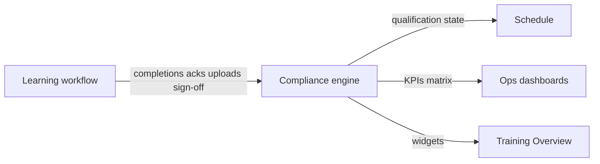

# Training domain architecture

Information architecture: **Training** replaces fragmented **Standards** training surfaces with three operational areas — **Overview**, **Learning**, and **Compliance**.

## Navigation

| Sidebar item | Route | Purpose |
|--------------|-------|---------|
| Overview | `/training/overview` | Readiness KPIs, expiring items, pending reviews, alerts (reads **Compliance** only) |
| Learning | `/training/learning/*` | Worker completion workflow — My Learning, assign, bundles, library, archive |
| Compliance | `/training/compliance/*` | Authoritative qualification state — matrix, workforce, registry, expiring & gaps |

**Routines** remain under **Operations** at `/standards/routines` (execution domain, not Training IA).

## Learning vs Compliance

| Area | Owns | Does not own |
|------|------|----------------|
| **Learning** | Assigned items, read/acknowledge/upload/submit, supervisor assign & bundle config, procedure library UX | Qualification math, expiry rules, matrix truth, staffing eligibility |
| **Compliance** | Matrix status, readiness, expirations, registry, deficiencies, admin overrides | Scheduling, notifications, routine execution |

## Learning structure

| Tab | Slug | Audience | Content |
|-----|------|----------|---------|
| My Learning | `my-learning` | Signed-in account (`session.sub` only) | `TrainingEmployeeSelfView`, `MyProceduresAssignmentsView` |
| Assign | `assign` | Team matrix roles (lead+) | `LearningAssignPanel` |
| Bundles | `bundles` | Admins / team matrix | `LearningBundleManager` |
| Procedure library | `library` | `procedures.view` | `ProceduresApp` (admin/authoring) |
| Acknowledgment archive | `archive` | **Company admin, manager, supervisor** | `ProcedureAcknowledgmentsArchiveClient` |

**Compliance** (`/training/compliance/*`) uses the same leadership gate as the archive — not visible to worker-tier accounts in nav or direct URL.

**Legacy URLs** redirect: `assignments` → `my-learning`, `procedures` → `library`, `acknowledgments` → `archive`.

### Learning Bundles

- Model: `frontend/lib/training/learning-bundles.ts`
- Items use `source: "procedure" | "external"` so CRD/integrated links can be added without restructuring.
- MVP persistence: per-company `localStorage`; assign uses existing `POST /api/v1/training/assignments` per procedure in the bundle.

### Core learning flow

`assigned learning → read/complete → acknowledge/upload → submit → supervisor review → compliance updated`

Workers should not need to browse the library for day-to-day work; library remains for admins and intentional lookup.

## Compliance structure

Single shell with tabs (not separate top-level pages):

| Tab | Former surface |
|-----|----------------|
| Matrix | `/standards/training/compliance` |
| Workforce | workers view |
| Certifications | registry |
| Expiring & gaps | expiring / deficiencies |

Matrix is the primary visualization (green complete, red missing, amber expiring, pending/review). Overview widgets and schedule/routine eligibility **consume** Compliance APIs and selectors — they do not duplicate qualification logic.

## Legacy routes

`/standards/training/*`, `/standards/procedures`, `/standards/my-procedures`, `/standards/acknowledgments` → canonical `/training/*`.

Registry feature keys (`training_*`, `procedures`, `standards_training`, etc.) and RBAC permissions are unchanged for contract compatibility.

## Key files

| Concern | Path |
|---------|------|
| Routes | `frontend/lib/training/routes.ts` |
| Access | `frontend/lib/training/training-domain-access.ts` |
| Bundles | `frontend/lib/training/learning-bundles.ts` |
| Shells | `frontend/components/training/domain/*` |
| Matrix engine | `frontend/components/training/TrainingComplianceDashboard.tsx`, `frontend/lib/training/selectors.ts` |
| APIs | `frontend/lib/trainingApi.ts` |
| App routes | `frontend/app/training/**` |
