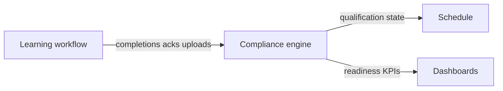

# Training domain architecture

Information architecture refactor: **Standards** presentation layer → **Training** domain with three operational surfaces.

## Navigation

| Sidebar item | Route | Purpose |
|--------------|-------|---------|
| Overview | `/training/overview` | KPIs, alerts, expiring queue, coverage risks (aggregates Compliance data) |
| Learning | `/training/learning/*` | Completion workflow — assignments, procedure library, acknowledgments |
| Compliance | `/training/compliance/*` | Authoritative qualification state — matrix, workforce, registry, queues |

**Routines** remain under **Operations** at `/standards/routines` (execution domain, not Training IA).

## What was merged

| Former surface | New home |
|----------------|----------|
| `/standards/training` (overview tab) | `/training/overview` |
| `/standards/training/workers` | Compliance → **Workforce** tab |
| `/standards/training/certifications` | Compliance → **Certifications** tab |
| `/standards/training/compliance` | Compliance → **Matrix** tab (primary) |
| `/standards/training/expiring` | Compliance → **Expiring & gaps** tab |
| `/standards/procedures` | Learning → **Procedure library** |
| `/standards/my-procedures` | Learning → **My assignments** |
| `/standards/acknowledgments` | Learning → **Acknowledgment archive** |
| Sidebar: Procedures + Training + My procedures | **Overview / Learning / Compliance** only |

## What stayed separate

- **Procedure authoring runtime** (`ProceduresApp`) — same component, new route.
- **Training matrix engine** (`TrainingComplianceDashboard`, selectors, APIs) — unchanged logic.
- **Workforce qualifications** (`WorkforceQualificationsProvider`, certification registry, overrides) — unchanged; consumed by Compliance tabs.
- **Routines** (`RoutinesApp`, `/standards/routines`) — Operations domain; consumes procedure/training signals but not owned by Training IA.
- **Facility inspections** (`/dashboard/compliance`) — unrelated “compliance” product area.

## Source of truth

- **Compliance** owns qualification calculations, expiry evaluation, registry coverage, matrix status, and session overrides used by schedule cert checks.
- **Learning** owns user actions (assignments, acknowledgements, uploads, submissions); it does not duplicate qualification math.
- **Schedule / notifications / routines / dashboards** read Compliance (and legacy worker cert codes + overrides); they do not own training state.

## Legacy routes

All former `/standards/training/*`, `/standards/procedures`, `/standards/my-procedures`, `/standards/compliance`, `/standards/certifications`, and `/standards/acknowledgments` paths **redirect** to the canonical `/training/*` routes.

Registry feature keys (`standards_training`, `procedures`, etc.) and RBAC permissions are **unchanged** for contract compatibility.

## Key files

- Routes: `frontend/lib/training/routes.ts`
- Shells: `frontend/components/training/domain/*`
- App routes: `frontend/app/training/**`
- Nav: `frontend/config/platform/master-feature-registry.ts`, `nav-domains.ts`
